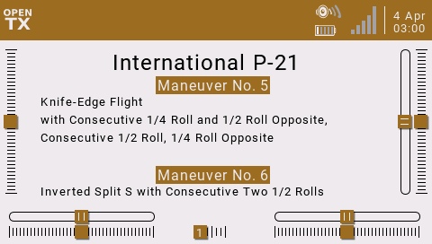
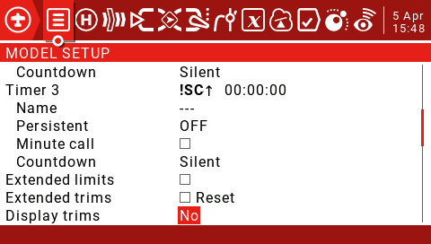
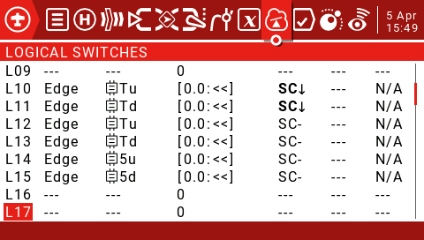
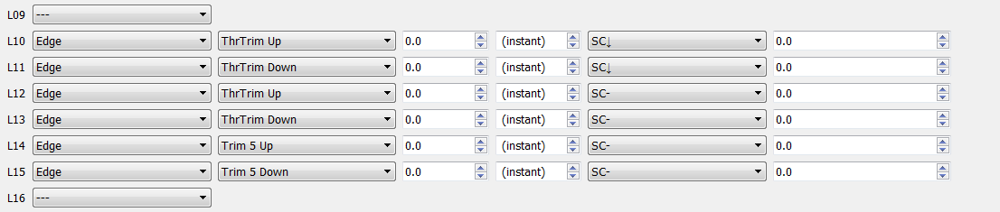
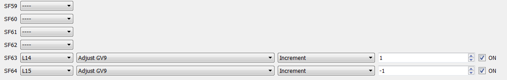

F3A Caller Widget Version 1.0
===========
*Caller for practicing F3A pattern*   
* 4/5/2021 Program fully funcitonal !   

  

Key Features
----------------
* Advances through each call forward or backwards (repeat a Maneuver) at your pace.   
* Choose which maneuver to work on.   
* All call lists built from the 2021 scorecards.     
* 2021 maneuver calls for both Internation F-21 and P-21 Contests.  
* AMA contests include maneuver calls for the:  
  1. Club Contests   
  2. Sportsman   
  3. Advanced   
  4. Masters   

Installation
-----------------
1.  The program was built to utilize Full screen (allowances were made for displaying trims).   
2.  Download the files (main.lua, sounds, and lists)
3.  Create a new folder under widgets and install the `main.lua` file.   
4.  Edit the program (switch numbers [9=SC(dn)] & logical switches @ line "59") to match your desired switch use.   
5.  Setup Timer 3 (timer was based a 3 position swicth Top position would not advance) This allows smooth scrolling through the choices.   
    
5.  Set you your logical switches.    
   
    
6.  Set 2 special functions SF63 & 64 (these adjust GV 9, which keeps track of which call list your using)    
   
   
7.  Copy the .wav files to `/SOUNDS/en`
8.  Create a folder "lists" under `/SOUNDS`  
9.  Copy the list folders into the newly created list directory(each of them have a pre-made playlist file in them)

The call list sounds were created using TTSAutomate availabe here https://ttsautomate.com/download.html.  
The file to make moficiations and change the voice is located in sounds, it is called `caller.psv`.

Enjoy!  Give me a star if you enjoy it.
If you have any issues or find something doesn't work, please create an issue, so others can benefit from the solution.
