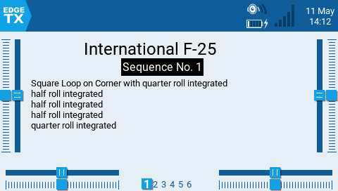
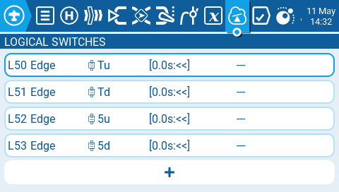
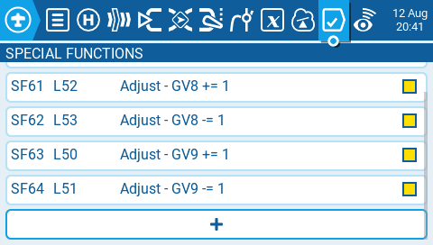

F3A Caller Widget Version 2.0
===========
*Caller for practicing F3A pattern*   
* Updated to 2024 Season   
   
     

Key Features
----------------
* Advances through each call forward or backwards (repeat a Maneuver) at your pace.   
* Choose which maneuver to work on.   
* All call lists built from the 2024 scorecards.     
* 2024 maneuver calls for both International F-21 and P-21 Contests.  
* AMA contests include maneuver calls for the:  
  1. Club Contests   
  2. Sportsman   
  3. Advanced   
  4. Masters
     
[Get Release 2.0](https://github.com/jrwieland/F3A/releases/tag/v2.0) 

## Widget Operation

Widget Options    
-Switch     
-Text Color (default color is Primary 2 from your theme)  

1.  The program was built to work as a widget.  It will announce the maneaver/sequence as printed on the applicable score card     
   
- Utilize it Full Size (allowances were made for displaying trims) to review the call sheet before performing the maneuvers.     
** Calls work, however, it is **HIGHLY FOOLISH** to look at the screen while flying    
    
- Everyother size widget zone displays only the class and sequence number.     
  it will announce them as you move through the sequence    
         
     
2. Place your selected switch down - (advance through the calls [using throttle trim up] go back to the previous maneuver [Throttle trim down]     
3. Place your selected switch middle - (repeat the maneuver call [using throttle trim up]     
4. Place your selected switch up (away)  - advance to a specific maneuver without hearig the call     
5. trim 5 moves through the lists F3A, AMA Advanced, etc.(if you have more than 1)    

Installation
-------------
1.  Download the files (Program for your version), sounds and playlists you want to practice.
2.  Move/copy the F3A folder to /WIDGETS in your SD Card.
3.  Copy the sounds to /SOUNDS/en.   
4.  Make a folder called "lists" in the /SOUNDS folder   place the maneuver folder in /SOUNDS/lists
   
*5.  Set you your logical switches.* 
set your open logisal switches as follows 
   
     

If you don't use these please adjust the main.lua file to reflect the switches you use    
    

*6.  Set 2 special functions SF63 & 64 (these adjust GV 9, which keeps track of which call list your using)*   The needs to match the LS you use advance through the calls i.e. 50 & 51
    
      
  
7.  Disable the throttle and F5 trims (these are the trims used to control it) these can be changed to fit your use. 

   
Enjoy!  Give me a star if you enjoy it.   
If you have any issues or find something does not work, please create an issue, so others can benefit from the solution.
